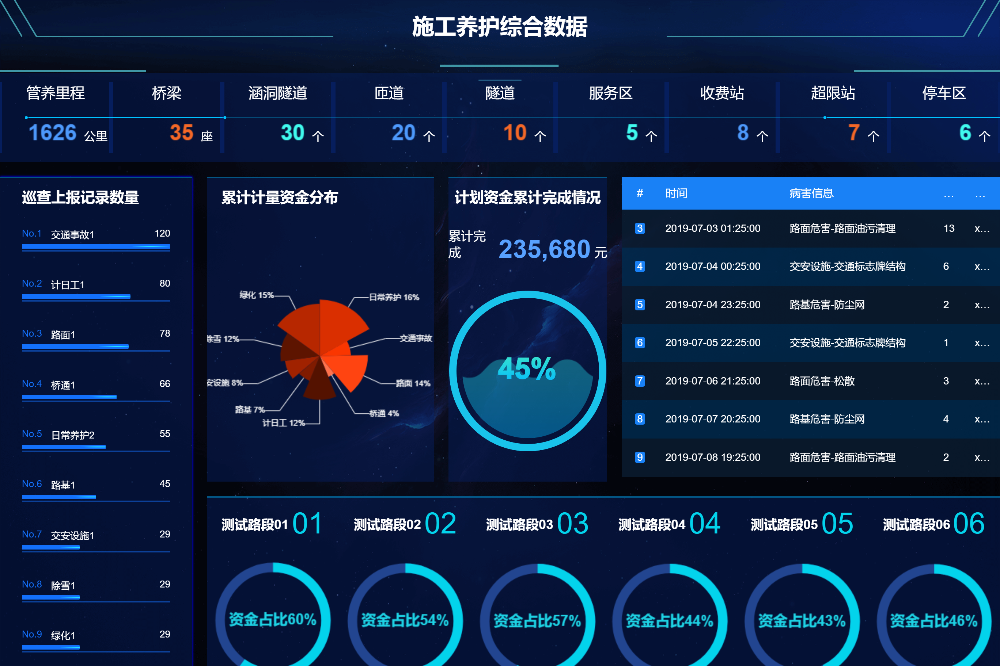

# ultra-rare
自定义报表

# 一、体验
## 1.1 准备
### 数据库
* 执行 file\sql\ruoyi\ry_20210210.sql
* 执行 file\sql\ur\ur.sql
* 执行 file\sql\ur\test.sql

## 1.2 ssr依赖
* git clone https://gitee.com/natsuki_kining/sql-starts-rapid.git
* cd sql-starts-rapid
* mvn clean install

## 1.3 启动
> 运行 ultra-rare\ur-main\src\main\java\com\natsuki_kining\UltraRareApplication.java

## 1.4 访问
> http://localhost:8080/bigScreen/index.html

## 1.5 效果图

# 大致开发计划
1. 熟悉ruoyi
2. √ ruoyi和ur的兼容性测试及调整
    * 修改了SSR的DruidProperties类名
    * 去除ruoyi的多数据源配置，使用SSR的多数据源配置。
3. √ 修改ruoyi代码生成功能
    * 生成类
    * 修改类
4. √ ur表数据的管理
5. 脚本编写页面
6. SQL编写页面
7. 图表绘制页面
8. 发布功能
9. 权限控制
10. ruoyi后台系统功能调整
11. 修改登录页面
12. 集成第三方登录
13. ssr性能测试及调整

#### 介绍
基于ssr跟datav实现的数据可视化大屏项目。
因为是基于ssr来写的，故取名为ur，即ultra rare。

# 大概功能

## 管理页面
* 数据
    * 数据源管理
    * 数据集管理
        * SQL/UR_SQL
        * JSON
        * Excel
        * rest接口
        * MongoDB
        * redis
* 监控
    * 发送邮件
    * 自定义事件
    * 计算机资源
    * JVM资源
    * SQL耗时过长警报        
* 大屏页面绘制
    * 展示模块
        * 数据刷新时间
        * 查询SQL
            * 动态生成SQL
        * 数据源选择
        * 样式选择 
        * 脚本编写与执行设置
    * 布局
        * 主题
            * 默认主题
            * 系统主题
    * 
* 大屏页面发布
    * 生成页面id与大屏页面相关数据
* 权限认证
    * 单点登录
    * 权限过滤    
## 大屏展示页面
* 根据id打开大屏页面